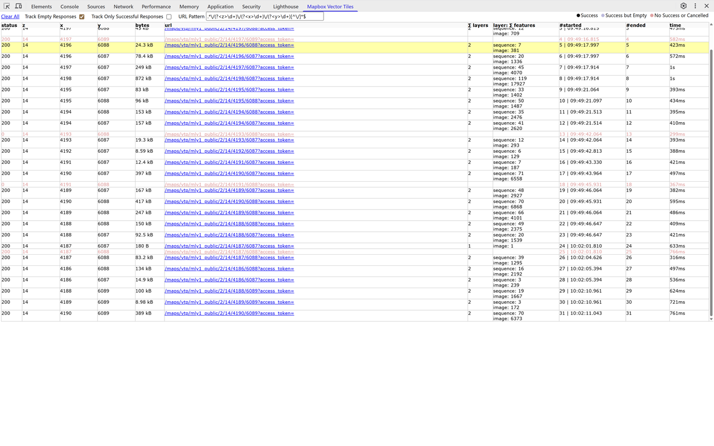
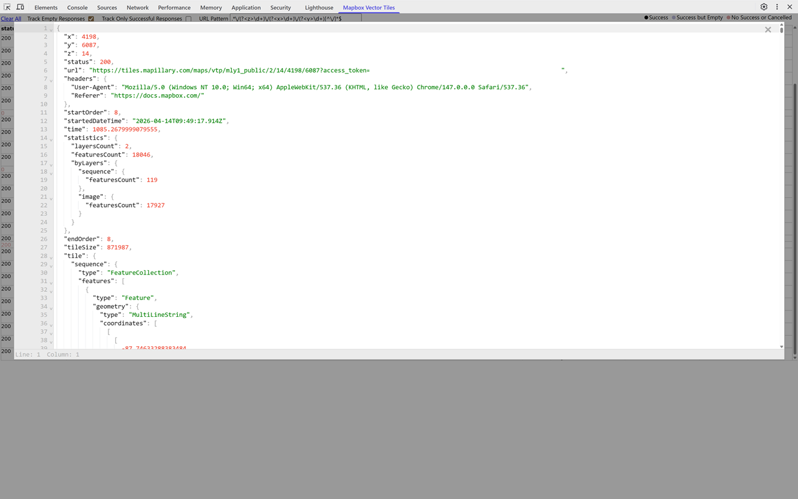

# Mapbox Vector Tiles

Just-in-time parser for loaded Mapbox Vector Tiles (https://docs.mapbox.com/vector-tiles/specification/).

Forked from the original by [Leonid Gorshkov](https://github.com/gorshkov-leonid/mapbox-vector-tiles-chrome-extension), but modified to use [Typescript](https://github.com/microsoft/TypeScript), [Vite](https://github.com/vitejs/vite) build tooling, and to comply with [Chrome's Manifest V3](https://developer.chrome.com/docs/extensions/develop/migrate/what-is-mv3). I also added dark mode (driven by the browser setting).

<picture>
  <source media="(prefers-color-scheme: dark)" srcset="./store-assets/screenshot1-dark.png">
  <source media="(prefers-color-scheme: light)" srcset="./store-assets/screenshot1-light.png">
  
</picture>

<picture>
  <source media="(prefers-color-scheme: dark)" srcset="./store-assets/screenshot2-dark.png">
  <source media="(prefers-color-scheme: light)" srcset="./store-assets/screenshot2-light.png">
  
</picture>

## Using

Open Chrome DevTools and select the **Mapbox Vector Tiles** panel. Tiles are listed as
they load; click a row to inspect the tile as GeoJSON, or click its URL to download the
raw `.mvt`.

### Settings

- **Capture by** — how requests are recognised as vector tiles.
  - **Content Type** (default) matches the response's content type, so it works whatever
    the URL looks like. The box holds the type to match; a few common ones are suggested,
    and any value can be typed. Tile coordinates are then read from the URL on a
    best-effort basis, and shown as `?` when it has no recognisable `z/x/y`.
  - **URL Pattern** matches a regular expression against the request URL. Named `z`, `x`
    and `y` capture groups supply the tile coordinates (falling back to the first three
    unnamed groups). Several presets are suggested.
- **Track Empty Responses** — keep rows for tiles that contain no features.
- **Track Only Successful Responses** — drop rows for failed or cancelled requests.

Settings are shared across DevTools windows, and the table keeps the most recent 1000
rows.

## Installing

1. Check if your `Node.js` version is >= **25** or use [Volta](https://github.com/volta-cli/volta).
2. Run `npm install` to install the dependencies.

## Developing

run the command

```shell
$ npm run dev
```

## Testing

run the command

```shell
$ npm test
```

## Packing

run the command

```shell
$ npm run build
```

Now, the content of `build` folder will be the packaged extension. To produce a zip for
the Chrome Web Store instead, run:

```shell
$ npm run zip
```
